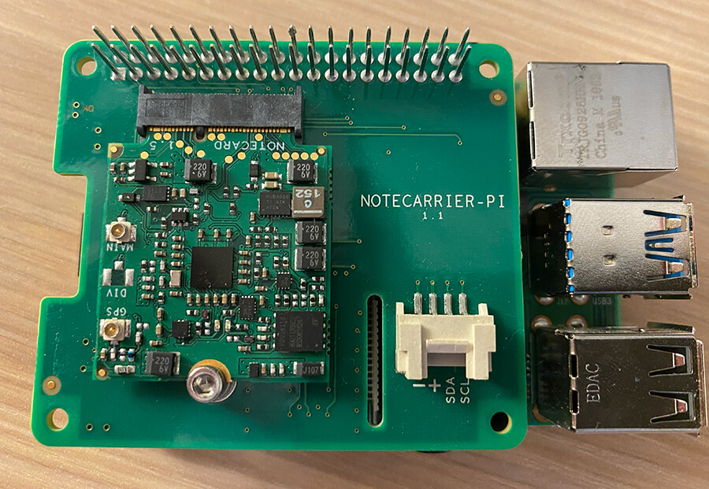

# Optimizing a Raspberry Pi for Off-Grid Power Consumption

In this project, I compared the power consumption of a stock Raspberry Pi 4
running on a 30,000mAh battery pack with
[cellular connectivity](https://blues.io/products/) to a Raspberry Pi configured
with a variety of [power optimization settings](NEEDLINK).

> Watch an [intro video](https://youtu.be/xjWqCkc_h7A) and then view the
> complete tutorial over at
> [Hackster.io](https://blues.io/blog/tips-tricks-optimizing-raspberry-pi-power/?utm_source=github&utm_medium=web&utm_campaign=featured-project&utm_content=battery-raspberry-pi)!

**Hardware:**

- [Raspberry Pi 4](https://www.raspberrypi.org/products/raspberry-pi-4-model-b/)
- [Notecard and Notecarrier-PI HAT](https://blues.io/products/) from Blues
  Wireless
- [USB-C Power Bank](https://smile.amazon.com/gp/product/B07H5T9J4L/ref=ppx_yo_dt_b_asin_title_o02_s02?ie=UTF8&psc=1)

**Software and Services:**

- [Notehub.io](https://blues.io/services/)
- [Datacake](https://datacake.co/)
- [Python](https://www.python.org/)
